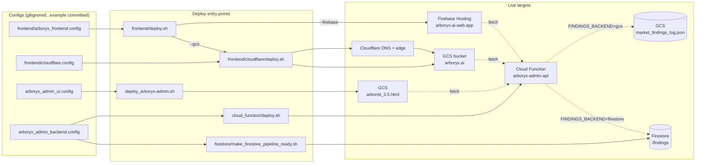

# Arboryx — Deploy Manual

> Deployment paths only. For maintenance (key rotation, cache control,
> backfills) see `dev-utils/`; for the Cloudflare-Free escalation playbook
> see the runbooks in `dev-utils/`.

**Last revision:** 2026-05-02

---

## 1. What gets deployed

| Component | Lives at | Source |
|---|---|---|
| Cloud Function API (`arboryx-admin-api`) | GCP `marketresearch-agents`, region `us-central1` | `cloud_function/` |
| Admin UI (`arborist_3.5.html`) | `gs://marketresearch-agents/...` (public read) | `arborist_3.5.html` + `assets/` |
| Public landing (`index.html`, `new_growth.html`) | `gs://arboryx.ai/` behind Cloudflare → `https://arboryx.ai/` | `frontend/` |
| Public landing (alt) | Firebase Hosting → `https://arboryx-ai.web.app/` | `frontend/` |
| Findings store (read backend) | GCS JSON **or** Firestore `/findings`, selected by `FINDINGS_BACKEND` | `arboryx.ai/` pipeline writes; `dev-utils/sync_gcs_to_firestore.py` mirrors |

Two orthogonal axes:

- **Frontend hosting** — GCS+Cloudflare *or* Firebase Hosting.
- **API read backend** — `FINDINGS_BACKEND=gcs` *or* `firestore`. Writes always land in GCS regardless; Firestore is a read mirror.

You can mix them (e.g., GCS+Cloudflare frontend with Firestore-backed API).

---

## 2. Architecture & deploy dependencies



**Reading the diagram:**
- Solid arrows = "produced/configured by deploy."
- Dotted arrows = "runtime data flow."
- `arboryx_admin_backend.config` is the shared GCP-project config — every server-side script reads it (also consumed by `cloud_function_rotator/`, `cloud_function_reminder/`, `dev-utils/*`; not shown to keep the diagram focused on user-facing deploys).

---

## 3. Configs

| File | Consumed by | Holds |
|---|---|---|
| `arboryx_admin_backend.config` | `cloud_function/deploy.sh` (+ rotator, reminder, firestore, dev-utils) | GCP project, bucket, function name, admin + read-only API keys, SMTP, **`FINDINGS_BACKEND`** |
| `arboryx_admin_ui.config` | `deploy_arboryx-admin.sh` | Admin UI HTML filename, API URL, **admin** key (substituted into `__ARBORYX_ADMIN_API_URL__` / `__ARBORYX_ADMIN_API_KEY__` placeholders) |
| `frontend/arboryx_frontend.config` | `frontend/deploy.sh` | Public-landing runtime (API URL, **read-only** key, sector/share toggles, brand) — written into `frontend/scripts/config.js` |
| `frontend/cloudflare.config` | `frontend/cloudflare/deploy.sh` | CF API token, zone/account IDs, GCS bucket name, `DOMAIN_OWNER_ACCOUNT` (only used for one-time bucket create) |

> **Two-key model is load-bearing.** Admin UI ships the *write* key; public landing ships the *read-only* key. Don't cross-wire them.

---

## 4. Deploy modes

### 4.1 Cloud Function API (deploy first, everything else depends on it)

```bash
bash cloud_function/deploy.sh                # auto: source-only update or full deploy
bash cloud_function/deploy.sh --full         # force full redeploy (re-applies IAM + env vars)
bash cloud_function/deploy.sh --dry-run      # preview gcloud command
```

The deploy bakes `FINDINGS_BACKEND` from `arboryx_admin_backend.config` into the function's env vars. Flip backends by editing the config and redeploying — or one-off override:

```bash
FINDINGS_BACKEND=firestore bash cloud_function/deploy.sh
```

**Verify:**
```bash
export ARBORYX_ADMIN_API_URL=https://arboryx-admin-api-pnucidjlvq-uc.a.run.app
export ARBORYX_ADMIN_API_KEY=<admin-key-from-config>
export ARBORYX_ADMIN_READ_ONLY_API_KEY=<read-only-key-from-config>
python3 dev-utils/test_api.py --suite all
```

---

### 4.2 Local — frontend dev preview, no upload

Use this while iterating on landing-page HTML/CSS/JS.

```bash
bash frontend/deploy.sh                      # default --local: regen scripts/config.js only
cd frontend && python3 -m http.server 8000
# open http://localhost:8000/index.html (or new_growth.html)
```

Same flow for the admin UI — open `arborist_3.5.html` in a browser, but you'll need to manually replace the `__ARBORYX_ADMIN_*__` placeholders in a working copy (or just deploy via §4.3 to a staging bucket).

**Useful smoke tests before any upload:**
```bash
node dev-utils/test_ui_render.js             # admin UI offline render check
node dev-utils/test_ui_live.js               # admin UI vs live API
node dev-utils/test_frontend_landing.js      # public landing vs live API
```

---

### 4.3 GCS — production-equivalent deploy (admin UI + public landing via Cloudflare)

Two independent steps; run whichever you changed.

**Admin UI:**
```bash
bash deploy_arboryx-admin.sh                 # injects creds, uploads HTML + assets
bash deploy_arboryx-admin.sh --dry-run       # preview
```

**Public landing:**
```bash
bash frontend/deploy.sh --gcs                # day-2: shim into cloudflare/deploy.sh --skip-verify --skip-dns
bash frontend/deploy.sh --gcs --dry-run
```

`--gcs` regenerates `scripts/config.js` then delegates to `frontend/cloudflare/deploy.sh`, which rsyncs the `frontend/` tree to `gs://arboryx.ai/`. The bucket is fronted by Cloudflare (apex CNAME → `c.storage.googleapis.com`), so the change is live at `https://arboryx.ai/` within seconds (subject to CF edge cache — bust with `?cb=$(date +%s)`).

**First-time bucket setup** (one-shot, requires the verified domain owner account because GCS gates `gs://<domain>` creation on Search Console ownership):
```bash
gcloud auth login info@solutionjet.net       # whoever is set in DOMAIN_OWNER_ACCOUNT
bash frontend/cloudflare/deploy.sh           # full flow: verify TXT → create bucket → IAM → DNS cutover
```
Subsequent deploys run under whatever account ADC resolves (the SA in normal dev env) — `--gcs` skips the verify + DNS stages.

> **Never commit `frontend/cloudflare.config`.** It carries a CF API token. If a deploy ever uploads it (it shouldn't — exclude regex covers it), rotate the CF token in dashboard immediately. See `dev-utils/workbench.md` for the post-mortem on the time this leaked.

---

### 4.4 Firebase / Firestore — alternative hosting + alternative read backend

These are two independent flips. Use either, both, or neither.

**(a) Firebase Hosting for the public landing** — alternative to GCS+Cloudflare:
```bash
# One-time
npm install -g firebase-tools
firebase login
firebase hosting:sites:create arboryx-ai --project marketresearch-agents

# Each deploy
bash frontend/deploy.sh --firebase
bash frontend/deploy.sh --firebase --dry-run
```
Lands at `https://arboryx-ai.web.app/`. Reads `FIREBASE_PROJECT` and `FIREBASE_SITE` from `frontend/arboryx_frontend.config`.

**(b) Firestore as the API read backend** — alternative to reading the GCS JSON:
```bash
# One-time setup (creates Firestore DB + indexes + rules)
bash firestore/make_firestore_pipeline_ready.sh

# Mirror current GCS data into Firestore (idempotent — re-runs are no-ops if upstream unchanged)
python3 dev-utils/sync_gcs_to_firestore.py --dry-run
python3 dev-utils/sync_gcs_to_firestore.py

# Flip the API
# Edit arboryx_admin_backend.config → FINDINGS_BACKEND="firestore"
bash cloud_function/deploy.sh
```

Frontend doesn't need redeployment — backend swap is invisible to the wire schema. To roll back: set `FINDINGS_BACKEND="gcs"` and redeploy the function.

---

## 5. Verify after any deploy

```bash
python3 dev-utils/test_api.py --suite all          # API: 39 tests
node dev-utils/test_ui_live.js                     # admin UI vs live API
node dev-utils/test_frontend_landing.js            # public landing vs live API
```

Expect zero failures.

---

## 6. Where the rest lives

- **Key rotation, secrets, SMTP** — `dev-utils/rotate_key.sh {public|admin|smtp}` (calendar-driven cadences and incident response). Rotator and reminder Cloud Functions: `cloud_function_rotator/`, `cloud_function_reminder/`.
- **Tooltip backfill** — `dev-utils/backfill_tooltips.py`.
- **Cache inspection / forced refresh** — `?action=cache_status` / `?action=refresh` on the API (admin key required for refresh).
- **Cloudflare-Free escalation playbook** (rate limiting, WAF, DDoS) — kept separate; ask if you need it surfaced again.
- **Design decisions / post-mortems** — `dev-utils/workbench.md` (living log).
- **Pre-2026-05-02 deploy history** — `git log`.
